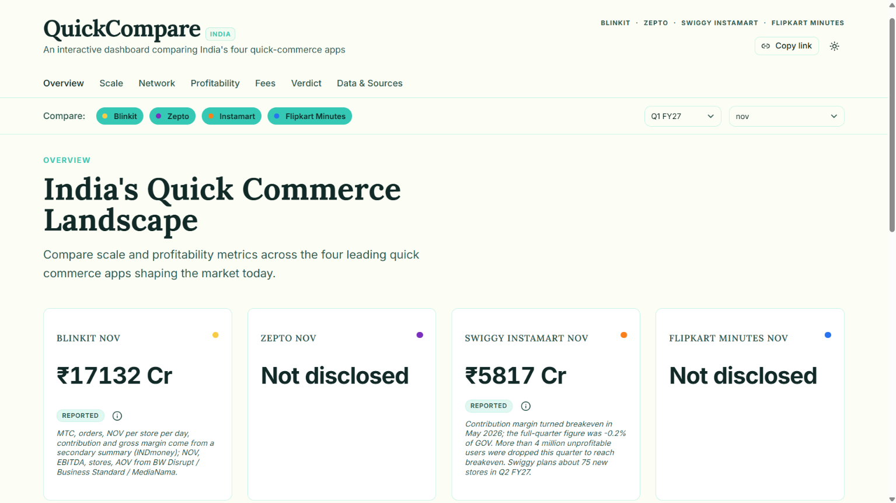
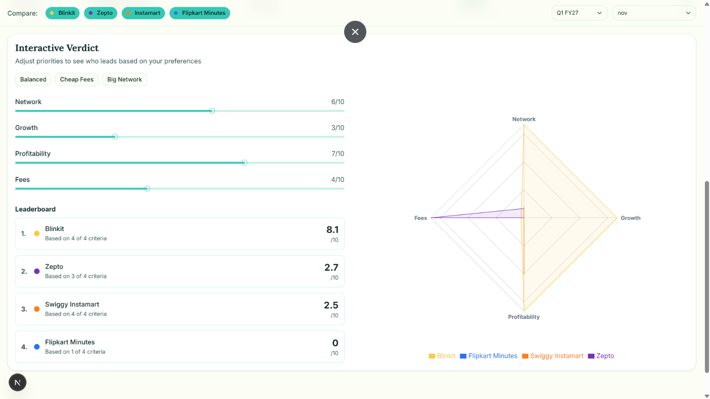
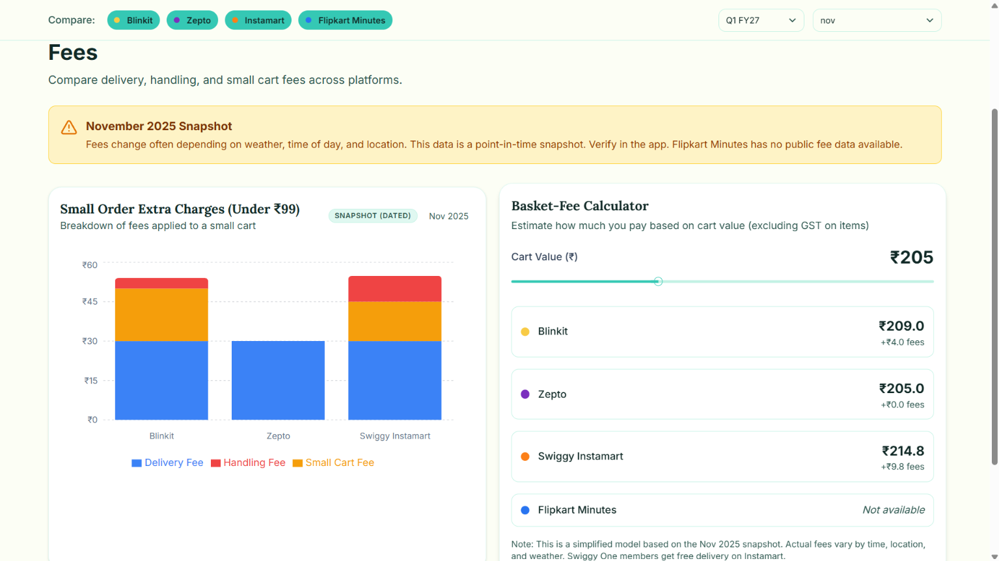

# QuickCompare India

**An editorial-style dashboard comparing India's four quick-commerce giants — Blinkit, Zepto, Swiggy Instamart, and Flipkart Minutes — using only real, publicly reported data.**

**Live demo:** [quick-compare-india.vercel.app](https://quick-compare-india.vercel.app)



---

## Why this exists

India's quick-commerce war is being fought in real time across four companies, but the full picture is scattered across earnings calls, IPO filings, and dozens of separate news articles. This dashboard pulls it into one place — with a citation on every single number.

**The core rule it's built around: zero fabrication.** Every figure traces to a real source. Nothing is estimated, averaged, or filled in. Where data isn't public, the dashboard says so explicitly rather than guessing.

---

## Features

- **No fabricated data** — every figure comes from company shareholder letters, DRHPs, or verified press reports, with a clickable source on every number
- **Data-quality badges** — each figure is labeled by reliability: `Reported`, `Derived`, `Company claim`, `Secondary source`, or `Snapshot (dated)`
- **Honest gaps** — undisclosed data renders as "Not disclosed," never a filled-in guess
- **Interactive Verdict** — adjust priority sliders (Network, Growth, Profitability, Fees) and watch a radar chart and leaderboard re-rank live, without silently penalizing apps that lack data for a given criterion
- **Basket-fee calculator** — estimate real delivery costs across platforms for a given cart value
- **Shareable views** — every filter selection is synced to the URL
- **Dark mode, fully responsive, accessible**




---

## Tech stack

| Layer | Tool |
|---|---|
| Framework | Next.js (App Router) + TypeScript |
| Styling | Tailwind CSS + shadcn/ui |
| Charts | Recharts |
| Animation | Framer Motion |
| URL state | nuqs |
| Validation | Zod |
| Data | Static JSON (no backend, no database) |
| Hosting | Vercel |

---

## Getting started

```bash
git clone https://github.com/JahnaviSarkar/quickcompare-india.git
cd quickcompare-india
npm install
npm run dev
```

Open `http://localhost:3000`.

```bash
npm run build   # production check
```

---

## Project structure

```
app/          Pages: overview, scale, network, profitability, fees, verdict, sources
components/   Charts, filters, quality badges, source popovers, fee calculator
data/         company-metrics.json, network-top10-cities.json, fees-snapshot.json
lib/          Types, Zod schemas, data loaders, derived metrics, scoring
```

---

## Updating the data

All figures live in `/data` as static JSON — no backend required.

1. Open the relevant file (`company-metrics.json`, `fees-snapshot.json`, or `network-top10-cities.json`)
2. Add the new figure with its `confidence` tier and a `source` entry (publisher, date, URL)
3. Use `null` for anything not publicly disclosed — never estimate
4. Run `npm run build`. Zod validation fails the build if a record is malformed or missing a source

**Primary sources used:** Eternal's shareholder letters (Blinkit), Swiggy's shareholder letters (Instamart), Zepto's DRHP, and broker/analyst mapping reports (CLSA) for cross-platform comparisons.

---

## Known data limitations

This is documented in full on the app's **Data & Sources** page, but in short:
- Blinkit and Instamart report quarterly; Zepto reports annually (FY26); Flipkart Minutes discloses no financials at all — these are never silently compared like-for-like
- Fee data is a **November 2025 snapshot** and may be out of date
- A couple of known reporting conflicts across sources (e.g. a Blinkit NOV typo in one outlet, differing Zepto revenue figures across press coverage) are called out directly rather than quietly resolved

---

## Deploying

Push to GitHub, import the repo on [Vercel](https://vercel.com), keep the Next.js defaults, and deploy. No environment variables needed.

---

## Disclaimer

This project is for educational and analytical purposes. It is not affiliated with Eternal, Swiggy, Zepto, Flipkart, or any of their parent companies, and is not investment advice.

## License

MIT

---

**Built by Jahnavi Sarkar** · [LinkedIn](https://www.linkedin.com/in/jahnavi-sarkar/)

---